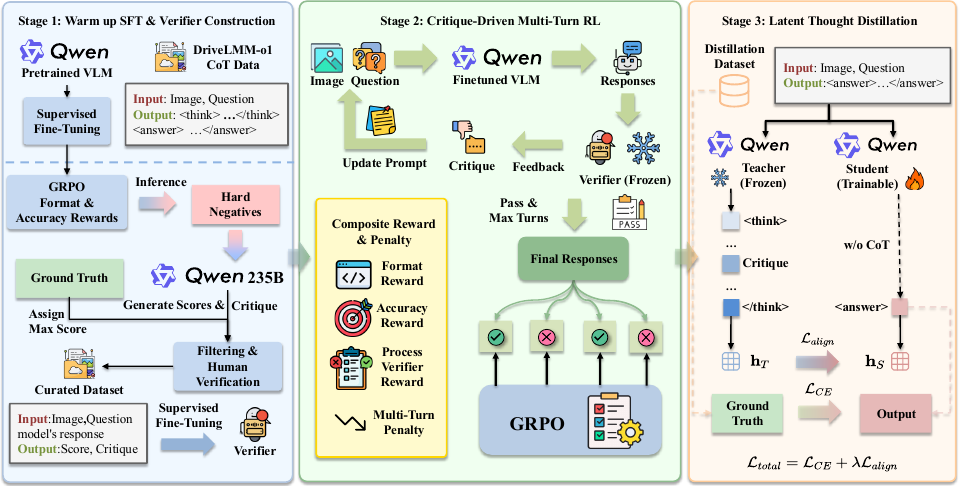

<div align="center">

# CritiqueDriveVLM: From Verifier-Guided Reinforcement Learning to Latent Thought Distillation for Autonomous Driving

[](LICENSE)
[](https://www.python.org/)
[](https://pytorch.org/)
[](https://eccv.ecva.net/)

Zhaohong Liu<sup>1</sup>, Hao Ye<sup>1</sup>, Xianlin Zhang<sup>2</sup>, Mengshi Qi<sup>\*1</sup>

<sup>1</sup> State Key Laboratory of Networking and Switching Technology, Beijing University of Posts and Telecommunications, China<br>
<sup>2</sup> School of Digital Media & Design Arts, Beijing University of Posts and Telecommunications, China

</div>

---

## News

- Our paper is accepted to **ECCV 2026**.

---

## Overview

**CritiqueDriveVLM** is a unified three-stage framework that internalizes reasoning directly into a Vision-Language Model (VLM) for autonomous driving. It resolves the reliability-efficiency trade-off of standard SFT and tool-augmented Chain-of-Thought (CoT) approaches:

- **Stage 1 — Warm-up SFT & Verifier Construction.** Enforces a structural reasoning format (`<think>...</think><answer>...</answer>`) and trains an independent multi-dimensional verifier over perception, logic, and safety.
- **Stage 2 — Critique-Driven Multi-Turn RL.** Uses verifier feedback and a step-decay multi-turn penalty under GRPO to cultivate a reliable System-2 Teacher.
- **Stage 3 — Latent Thought Distillation.** Aligns the Student's `<answer>` hidden state with the Teacher's final `</think>` hidden state, internalizing deep reasoning into a fast, CoT-free System-1 Student.

On the **DriveLMM-o1** benchmark, our Teacher boosts Multiple Choice Quality (MCQ) from 55.54% to **76.54%**, while the distilled Student reaches 68.59% MCQ using only **~28 tokens**, reducing inference latency by **88%** (3482 ms → **416 ms**).

<div align="center">
  <br>
  <em>The three-stage CritiqueDriveVLM pipeline.</em>
</div>

---

## Results

**Teacher (Stage 2) — DriveLMM-o1, tool-free:**

| Model | Risk Assess. | Rule Adh. | Scene Aware. | Relevance | Missing | Reason. | **MCQ** |
|---|---|---|---|---|---|---|---|
| GPT-4o | 71.32 | 80.72 | 72.96 | 76.65 | 71.43 | 72.52 | 57.84 |
| Qwen3-VL-8B | 79.50 | 84.32 | 80.41 | 84.43 | 75.32 | 77.76 | 55.54 |
| DriveLMM-o1 | 73.01 | 81.56 | 75.39 | 79.42 | 74.49 | 75.24 | 61.27 |
| AgentThink | 80.51 | 84.98 | 82.11 | 84.99 | **79.56** | 79.68 | 71.35 |
| OmniDrive-R1 | **82.31** | 85.42 | **83.75** | 82.58 | 78.26 | 80.35 | 73.62 |
| **Ours-Teacher (Stage 2)** | 81.63 | **86.21** | 82.27 | **85.46** | 79.17 | **80.48** | **76.54** |

**Efficiency (Stage 3) — System-1, CoT-free:**

| Model | CoT | Tool | Avg. Tokens ↓ | Avg. Time (ms) ↓ | MCQ ↑ |
|---|:---:|:---:|---|---|---|
| Ours-Teacher (Stage 2) | ✓ | ✗ | 223.32 | 3482 | **76.54** |
| AgentThink | ✓ | ✓ | 515.01 | 5416 | 71.35 |
| Qwen3-VL-8B (SFT), CoT-free | ✗ | ✗ | 23.65 | 343 | 61.73 |
| **Ours-Student (Stage 3)** | ✗ | ✗ | 28.83 | **416** | **68.59** |

---

## Environment Setup

We use [`uv`](https://docs.astral.sh/uv/) for dependency management.

```bash
git clone https://github.com/MICLAB-BUPT/CritiqueDriveVLM.git
cd CritiqueDriveVLM
uv sync --extra build
```

Stage-2 reinforcement learning additionally requires [verl](https://github.com/volcengine/verl),
installed separately from source.

---

## Repository Structure

```
CritiqueDriveVLM/
├── stage1_verifier/    # Warm-up SFT + verifier SFT (LLaMA-Factory configs); data on HF
├── stage2_rl/          # Critique-Driven Multi-Turn RL (verl / GRPO): reward + interaction
├── stage3_distill/     # Latent Thought Distillation (Teacher -> CoT-free Student)
├── inference/          # Teacher / Student / latency inference
├── evaluation/         # DriveLMM-o1 scoring protocol (GPT-4o judge)
└── assets/
```

Each stage folder has its own `README.md` with details. Scripts expose their
paths through a `CONFIG` block (or CLI args) — edit these for your environment.

---

## Usage

We use the **[DriveLMM-o1](https://huggingface.co/datasets/ayeshaishaq/DriveLMMo1)**
dataset (built on nuScenes). Multi-view frames are stitched into a single image
via `stage1_verifier/preprocess/stitch_multiview.py`.

**Stage 1 — Warm-up SFT & Verifier Construction** ([details](stage1_verifier/README.md))

Two LoRA SFTs via LLaMA-Factory. Download the datasets from HuggingFace, register
them, then train (no data-construction code needs to be run):
```bash
llamafactory-cli train stage1_verifier/configs/warmup_sft.yaml     # base policy (<think>/<answer>)
llamafactory-cli train stage1_verifier/configs/verifier_sft.yaml   # multi-dimensional verifier
```

**Stage 2 — Critique-Driven Multi-Turn RL (Teacher)** ([details](stage2_rl/README.md))
```bash
cd stage2_rl
bash serve_verifier.sh     # Terminal A: serve the frozen verifier
bash run_grpo.sh           # Terminal B: GRPO training (K=2 turns, step-decay penalty)
bash merge_lora.sh         # merge checkpoint -> deployable Teacher
```

**Stage 3 — Latent Thought Distillation (Student)** ([details](stage3_distill/README.md))
```bash
cd stage3_distill
python extract_teacher_hidden_states.py   # cache Teacher's final </think> states
deepspeed train_distill.py                # L_total = L_CE + lambda * L_align
```

**Inference & Evaluation**
```bash
python inference/infer_teacher.py     # multi-turn Teacher (needs the verifier server)
python inference/infer_student.py     # CoT-free Student
python inference/infer_latency.py     # latency / token profiling
export OPENAI_API_KEY=sk-...           # GPT-4o judge (DriveLMM-o1 protocol)
python evaluation/evaluate.py         # DriveLMM-o1 scoring
```

---

## Acknowledgments

This project builds upon the following open-source works:

- [verl](https://github.com/volcengine/verl) — RL framework for LLMs
- [LLaMA-Factory](https://github.com/hiyouga/LLaMA-Factory) — Efficient fine-tuning framework
- [DriveLMM-o1](https://github.com/ayesha-ishaq/DriveLMM-o1) — Step-by-step reasoning benchmark for driving

---

## Citation

```bibtex
@inproceedings{liu2026critiquedrivevlm,
  title     = {CritiqueDriveVLM: From Verifier-Guided Reinforcement Learning to Latent Thought Distillation for Autonomous Driving},
  author    = {Liu, Zhaohong and Ye, Hao and Zhang, Xianlin and Qi, Mengshi},
  booktitle = {European Conference on Computer Vision (ECCV)},
  year      = {2026},
}
```

---

## License

This project is licensed under the [Apache License 2.0](LICENSE).
